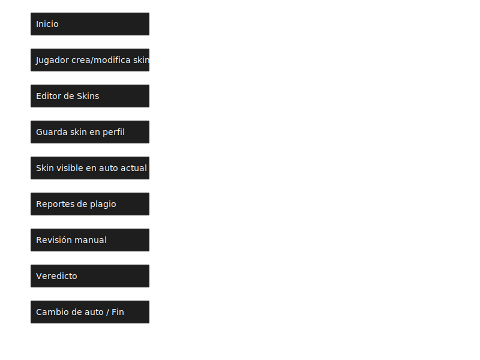

# Juego-de-autos 🚗
Project Car RPG MMO

# 🏎️ Game Design Document: “Project Car RPG MMO”

## 1. 🎯 Visión General

**Nombre Tentativo:** Project Car RPG MMO  
**Género:** MMO / JRPG / Simulador de conducción  
**Estilo visual:** Underground agresivo (inspirado en *Night Runners Prologue*)  
**Plataformas:** PC (teclado/ratón, joystick, volante), posible expansión a consolas  
**Inspiraciones:** Lost Ark, WoW, Tour de Francia, Cars, simuladores de rally, fr legends

---

## 2. 🌍 Mundo y Ambientación

- Mapa vertical: 1 ciudad subterránea + 3 ciudades en superficie conectadas por rutas
- Zonas temáticas:
  - Asfalto (drift, carreras)
  - Off-road hostil (todo terreno)
  - Zona destructible (autos pesados)
- Clima dinámico: lluvia, nieve, neblina, sol
- Misiones integradas al entorno: sin menús, todo visible en el mapa (celular in-game, señales, NPCs)

---

## 3. 🚗 Vehículos y Roles

### Filosofía
Cada jugador tiene pocos autos, pero los personaliza profundamente. Cada auto es como un personaje RPG con rol, historia y evolución.

### Roles de autos
| Rol         | Función en equipo | Ejemplo de auto |
|-------------|------------------|------------------|
| Tanque      | Rompe obstáculos, protege | SUV tuneado, pick-up pesada |
| Sprinter    | Contrarreloj, velocidad | Coupé liviano, hatchback |
| Soporte     | Asistencia técnica, distracción | Van equipada, auto con gadgets |
| Control     | Bloqueo, interrupción | Sedán defensivo |
| Especialista| Hackeo, salto, tareas únicas | Auto modificado con habilidades raras |

---

## 4. 🛠️ Personalización

### Mecánica
- Piezas reales: splitters, suspensiones, frenos, motores, etc.
- Crafteo en housing con materiales y tiempo
- Mecánico NPC para asesorar e instalar (con costo)

### Estética
- Exterior: pintura libre, vinilos, bodykits, luces, ruedas
- Interior: tapizados, gadgets, salpicaderos, radio con Spotify/YouTube Music
- Sistema de skins: artistas reconocidos por comunidad, protección anti-plagio (pendiente de sistema)

---

## 5. 🎮 Jugabilidad

### Controles
| Método       | Dificultad | Recompensa |
|--------------|------------|------------|
| Teclado/ratón| Fácil      | Baja       |
| Joystick     | Media      | Media      |
| Volante/sim  | Difícil    | Alta       |

### HUD
- Minimalista, dependiente del auto y cámara
- Velocímetro y datos visibles solo si el auto los tiene

### Actividades
- Misiones PvE: jefes, pandillas, policías
- Misiones secundarias: farming, housing, crafting
- Actividades sociales: abrir capó, mostrar motor, encuentros
- Posible PvP: carreras clandestinas, duelos de tuning

---

## 6. 📖 Narrativa

- Historia personal de cada jugador y su auto
- Progresión emocional y técnica
- Nervios reales en cada carrera por lo que está en juego

---

## 7. 🧠 Sistema de Skins

- Artistas pueden crear diseños únicos
- Comunidad vota y reconoce trabajos originales
- Sistema anti-plagio (por definir: timestamp, trazabilidad, estilo único)

---

## 8. 🧪 Ideas en prueba

- Colisión entre jugadores activos/inactivos (testeo anti-trolls)
- Avatares con movimiento limitado fuera del auto
- Sistema de reputación por estilo de conducción
- Mentoría entre jugadores para enseñar mecánica

---

## 9. 📦 Recursos y Economía

- Partes compradas o crafteadas
- Mecánico cobra por instalación
- Farming y housing como fuente de materiales
- Recompensas por misiones, eventos y estilo de conducción

---

## 10. 🔊 Sonido

- Motores con rugido único por tipo y mejora
- Cambios mecánicos afectan sonido
- Música personalizada vía plataformas de streaming

---

## 11. ⚙️ Documentación Técnica: Físicas Avanzadas

- [🛞 Neumáticos](docs/neumaticos.md)
- [⚙️ Diferenciales](docs/diferenciales.md)
- [🛠️ Suspensión](docs/suspension.md)
- [🔋 Motor](docs/motor.md)
- [📊 Telemetría](docs/telemetria.md)
- [🪂 Aerodinámica](docs/aerodinamica.md)
### 🧭 Diagrama de Flujo

